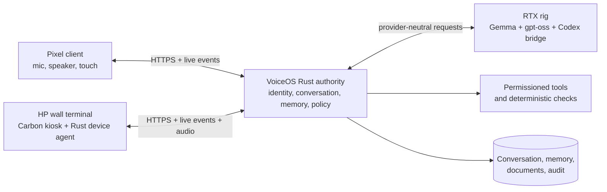

# VoiceOS shared conversation and wall terminal roadmap

## Target outcome

VoiceOS has one continuous, server-owned conversation and memory space for its
owner. The Pixel and the HP wall terminal are independently enrolled clients of
that owner. A turn begun on either device immediately becomes part of the same
history and is available to Gemma, gpt-oss, and Codex on the following turn.

The HP EliteDesk G2 is mounted out of sight and connected to:

- a touchscreen monitor over HDMI or DisplayPort plus USB for touch;
- a full-duplex USB microphone/speaker device, preferably with hardware acoustic
  echo cancellation;
- wired Ethernet, with Tailscale as the private application network;
- optional physical microphone-mute and power controls.

The RTX 5060 Ti rig remains the inference host. The HP runs the Carbon Command
kiosk, captures and plays audio, and can later host the Rust conversation and
memory database. It does not need to run the main language models.

## System topology

The logical `Core` and `DB` can initially remain on the rig. Moving them to the
HP later changes deployment, not the public client contract.

## Product decisions

### Shared conversation ownership

Replace device-owned conversation and memory with owner-owned state:

- `owners`: the person or household identity that owns conversation state;
- `devices`: independently enrolled Pixel, HP terminal, and future clients;
- `owner_devices`: enrollment relationship, role, display name, and revocation;
- `conversations`: owned by `owner_id`, not `device_id`;
- `messages`: record the originating device and a server sequence number;
- `memories` and `documents`: owned by `owner_id` with provenance from a device;
- `device_cursors`: last event delivered to each client.

For the current single-user installation, enrollment always links a new device
to the one configured owner. The schema should still avoid hard-coding one user
so a guest or household mode can be added without another migration.

### Response behavior across devices

- The device that submitted a turn speaks the answer by default.
- Other connected devices update their transcript silently.
- A spoken or touch command can transfer playback: “continue on the wall” or
  “send this to my phone.”
- Every turn gets a unique request ID. Duplicate retries cannot create duplicate
  messages or execute a tool twice.
- If both devices speak at once, the server serializes completed turns and tells
  the later client that another turn was added first.

### Voice activation

Use staged activation instead of beginning with an always-open microphone:

1. Large touch-to-talk control on the wall terminal.
2. Optional physical button or keyboard-free USB button.
3. Locally detected wake phrase after room audio tests pass.

The wake detector must run locally on the HP. Audio should not leave the HP
until wake or touch activation. The screen must show an unmistakable listening
indicator, and a physical mute control is strongly recommended.

### Audio placement

The first HP client can send buffered mono PCM to the existing audio endpoint.
The production path should stream Opus with voice activity detection and support
barge-in, allowing the user to interrupt speech naturally. Recognition can run
on the RTX rig; synthesized speech can initially use the HP operating system,
then move to a consistent server voice if desired.

Acoustic echo cancellation is essential when the microphone and speaker share a
room. A USB conference speakerphone with built-in full-duplex echo cancellation
is a safer first test device than unrelated microphone and speakers.

## Phased implementation

### Phase 0 — Record contracts and baseline

Deliverables:

- Capture representative Pixel turns, approvals, provider switches, memory
  recall, and file retrieval as contract fixtures.
- Add architecture decision records for owner-scoped conversations, reply-device
  policy, and the HP/rig deployment boundary.
- Back up both SQLite databases and document the restore command.

Exit test: current Android behavior and all Python/Rust tests pass from a clean
checkout before the identity migration begins.

### Phase 1 — Shared identity and conversation migration

Status: server foundation deployed August 3, 2026. Existing Rust messages,
memories, and documents are migrated under `voiceos-primary-owner`; newly
enrolled devices join that owner, messages retain their originating device and
monotonic sequence, and client request IDs deduplicate stored user/assistant
pairs. Device-management UI, rename, revocation, and credential rotation remain.

Deliverables:

- Add `owner_id`, device membership, originating device, and event sequence
  fields to the Rust contracts and SQLite schema.
- Create a migration that places every existing enrolled device and its data
  under the initial owner without losing messages, documents, or memories.
- Resolve a conversation by authenticated owner rather than device.
- Keep `session_id` as a compatibility alias until clients are migrated.
- Add device list, rename, revoke, and credential-rotation operations.

Exit tests:

- A Pixel turn followed by an HP turn reaches every provider with one ordered
  history.
- Revoking the HP does not revoke the Pixel.
- Two retries with the same request ID produce one stored turn.
- Existing audit history migrates idempotently.

### Phase 2 — Conversation read and live synchronization API

Status: server API deployed August 3, 2026. Authenticated snapshot,
`after=<sequence>` recovery, and resumable SSE routes are available through the
public Python compatibility gateway without changing the turn API. Pixel and
kiosk client subscriptions, playback targeting, and presence remain.

Deliverables:

- `GET /v1/conversations/active` for the initial snapshot.
- `GET /v1/conversations/active/messages?after=<sequence>` for recovery.
- an authenticated Server-Sent Events stream for messages, provider status,
  approvals, and tool results;
- resumable event IDs and bounded retention;
- per-device playback targeting and presence.

Use SSE first because clients mainly receive server events and it is simple to
recover after sleep. Keep audio on a separate streaming transport.

Exit tests:

- A turn from either client appears on the other within one second on the local
  tailnet after inference completes.
- Reconnecting after network loss fills every missing message exactly once.
- Only the initiating device speaks unless playback is explicitly transferred.

### Phase 3 — HP hardware and operating-system bring-up

Recommended base: Ubuntu 24.04 LTS on the HP, using a dedicated unprivileged
`voiceos-kiosk` account. This matches the existing rig tooling and gives the old
Intel system a stable, long-supported base.

Hardware checklist:

- Confirm model, CPU architecture, UEFI mode, storage health, and available
  video outputs.
- Test touchscreen video and USB touch input before mounting.
- Test microphone capture, speaker playback, full-duplex operation, echo, and
  listening distance in the intended room.
- Prefer Ethernet; verify Tailscale reconnects after reboot and network loss.
- Check display brightness, viewing angle, wall ventilation, cable strain
  relief, and access to the physical power button.

Software checklist:

- Minimal Ubuntu installation with automatic security updates.
- PipeWire/ALSA audio and touch calibration.
- Tailscale with no public Funnel exposure.
- Dedicated kiosk user with no sudo and no stored model credentials.
- Chromium in kiosk mode or a minimal Wayland kiosk compositor.
- systemd units for the kiosk UI and Rust device agent, with restart limits.
- Disabled desktop notifications, screen lock prompts, and unattended dialogs.
- Controlled screen blanking plus touch/wake restoration.

Exit test: after cold boot with no keyboard or mouse, the HP reaches Carbon
Command, reports online, records a clear sample, plays it back, and recovers from
an unplugged/reconnected network cable.

### Phase 4 — Carbon Command live kiosk

Deliverables:

- Replace representative kiosk data with the active conversation snapshot and
  live event stream.
- Add large touch targets for Talk, Stop, Repeat, Correct, Approve, Deny, Mute,
  playback speed, and output transfer.
- Display listening, transcribing, thinking, tool approval, speaking, offline,
  and degraded states.
- Add provider and system-health indicators without exposing administrator
  controls on the default screen.
- Cache the application shell locally so the UI still explains an outage.

Exit test: the kiosk can complete normal conversation, correction, interruption,
approval, denial, and recovery flows without a keyboard or mouse.

### Phase 5 — Rust HP device agent and voice pipeline

Deliverables:

- Rust agent for audio-device discovery, capture, playback, level metering, and
  physical mute state.
- Browser-to-agent loopback protocol restricted to the kiosk origin.
- Buffered audio vertical slice, followed by streaming Opus and VAD.
- Barge-in that stops local playback immediately and cancels or supersedes the
  active response.
- Local wake phrase behind a feature flag with explicit privacy controls.

Exit tests:

- Speech is intelligible from the expected standing distance.
- VoiceOS does not transcribe its own spoken reply during full-duplex use.
- Touch interruption stops audio promptly.
- Muted or pre-wake room audio is never uploaded.

### Phase 6 — Ontology, validation, and permission integration

Deliverables:

- Provider-neutral canonical intent and entity types in Rust.
- Deterministic aliases for common device, playback, provider, memory, and
  system-check phrases.
- Typed argument, range, state, confidence, and permission validators.
- Structured-model fallback only when deterministic resolution cannot decide.
- Clarification for ambiguity and approval for every consequential action.
- Audited, owner-approved custom aliases.

Exit test: equivalent phrases spoken on either device resolve to the same
canonical request, and no model output can bypass validation or approval.

### Phase 7 — Operational hardening

Deliverables:

- Encrypted, tested backups and restore drills for conversation and audit data.
- Credential rotation, device revocation, retention settings, and delete/export.
- Health checks for the HP agent, Rust core, database, Tailscale, Ollama, GPU,
  Codex bridge, microphone, speaker, and kiosk process.
- Offline/degraded behavior and human-readable recovery instructions.
- Watchdog restart with crash-loop protection and remotely accessible logs.
- Security review of the loopback agent, SSE authentication, document context,
  and internal HP-to-rig calls.

Exit test: reboot, service crash, rig outage, HP outage, expired credential, and
database restore exercises all have documented and repeatable recovery paths.

### Phase 8 — Move memory authority and retire Python

After the HP proves stable, move the Rust core and memory database there while
leaving inference on the RTX rig. Use a clean SQLite backup or service shutdown,
verify checksums, and retain a rollback copy.

Retire the Python gateway only after Rust has parity for enrollment,
authentication, tools, approvals, replay protection, audit, backup, and every
public route. Keep Python disabled but recoverable for one rollback window.

## Recommended execution order

The owner migration and server-side live API are complete. The next three
engineering slices are now:

1. **Client live-sync cutover:** subscribe Android and Carbon Command to the
   snapshot/recovery/SSE contract, persist their cursor, update silently for
   turns originating elsewhere, and speak only locally initiated replies.
2. **HP bring-up package:** create an inventory script and idempotent Ubuntu kiosk
   bootstrap, then test touchscreen, USB audio, Ethernet, Tailscale, and cold boot.
3. **Playback presence and transfer:** add device presence, reply-device policy,
   and “continue on the wall/send this to my phone” controls.

The HP should not receive the production memory database until these slices pass
on the rig and laptop. It can be hardware-tested and used as a client immediately.

## Definition of the first wall-terminal milestone

The first useful milestone is complete when:

- the HP cold-boots directly into Carbon Command;
- touch-to-talk works through the USB audio device;
- its turn is processed by the RTX rig;
- the answer is spoken only on the HP;
- the same turn appears on the Pixel;
- the next Pixel question includes the HP turn in model context;
- approvals remain tied to the requesting device and exact action;
- unplugging and restoring the network reconnects without a keyboard or mouse.

Wake phrase, server-quality TTS, and moving the memory database onto the HP come
after this milestone. They should not block the first real room test.
